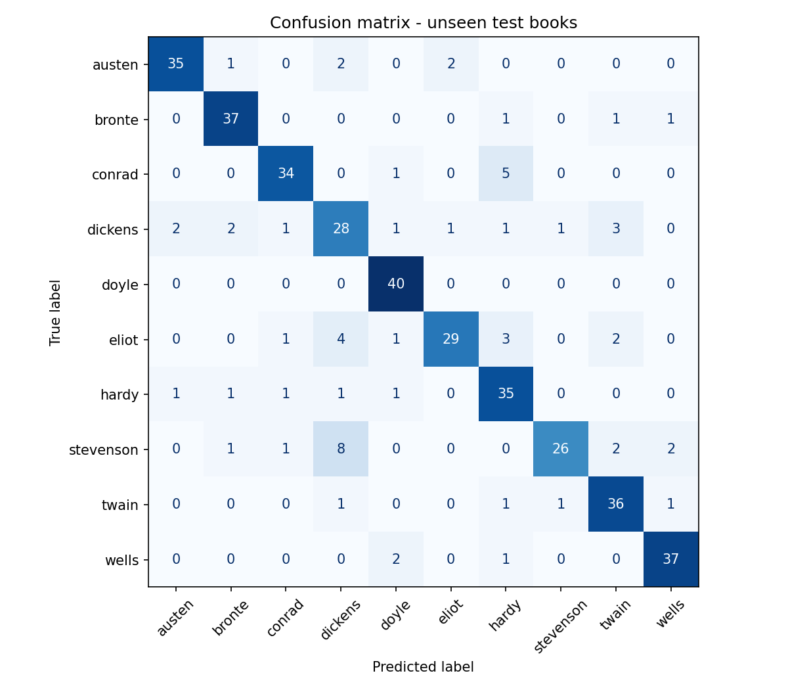

# Who Does Your Writing Sound Like? ✍️

Paste any piece of writing and find out which classic novelist your **writing style** is closest to, and *why*.
A classical NLP model does the stylometry; an LLM turns its findings into a plain-English explanation.

| | |
|---|---|
| **Name** | Mahi Sharma |
| **Registration No.** | 23FE10CDS00276 |
| **Branch** | B.Tech CSE (Data Science) |
| **Batch** | F |
| **GitHub** | [mahi-sharmas](https://github.com/mahi-sharmas) |
| **Course** | Natural Language Processing – Project |


---

## How it works

```
Your text ──► style features ──► Logistic Regression ──► closest author + top 3 habits ──► LLM (Groq) ──► explanation
             (91 numbers +                                (e.g. "uses 'very' 2x more
              char n-grams)                                 than average")
```

1. **Data** (`src/data.py`): 40 public-domain novels from Project Gutenberg, 10 authors × 4 books.
   Books are cleaned (licence text, chapter headings, transcription quirks like curly quotes removed) and cut into 500-word chunks.
2. **Features** (`src/features.py`): 91 style measurements per chunk: sentence length, word length,
   vocabulary richness, punctuation rates, and frequencies of 77 *function words* ("the", "upon", "very"…),
   which authors use unconsciously regardless of topic. Character names are masked so the model can't cheat.
3. **Model** (`src/train.py`): Logistic Regression on the style features + character 2–4-gram TF-IDF.
4. **LLM explanation** (`src/llm.py`): the model's top 3 style habits are sent to an LLM via the Groq API,
   which explains them in friendly language using **only** the numbers it is given (no invented facts).
5. **App** (`src/app.py`): a Gradio web interface.

## Evaluation (unseen books)

For **every** author, the model trains on 3 books and is tested on a 4th book it has never seen
(120 train / 40 test chunks per author, 1,600 chunks total).

| Model | Accuracy | Macro-F1 |
|---|---|---|
| Random guess (10 authors) | 0.100 | – |
| Style features only | 0.743 | 0.742 |
| **Style + character TF-IDF** | **0.843** | **0.841** |

- Easiest: Doyle (recall 1.00), Wells, Brontë, Austen (F1 ≈ 0.90).
- Hardest: Dickens (F1 0.67) and Stevenson (recall 0.65); Stevenson's test book (*Jekyll and Hyde*) is horror,
  while his training books are adventure stories, so the genre shift hurts.
- Accuracy drops on short texts; 200+ words gives reliable results.



## LLM integration

| File | Role |
|---|---|
| `prompts/prompts.yaml` | **Prompt file**: system prompt (role, 6 rules, fixed output format, one worked example) + user template with `{placeholders}` |
| `config.yaml` | **Config file**: authors/books, chunk sizes, model settings, LLM provider/model/timeout/retries |
| `src/llm.py` | Fills the template with the classifier's facts and calls the LLM |

Design choices:
- **Grounded:** the LLM never sees your text, only the classifier's numbers, so it can't hallucinate facts.
- **Robust:** 20 s timeout, 3 retries with exponential backoff, and a plain-analysis fallback, so the app never breaks if the LLM is down.
- **Swappable:** provider and model live in `config.yaml`. (This project switched from Gemini to Groq by editing two files.)

## Repository structure

```
├── config.yaml            # all settings
├── prompts/prompts.yaml   # LLM prompt file
├── src/
│   ├── data.py            # download, clean, chunk, split
│   ├── features.py        # style features + name masking
│   ├── train.py           # train, evaluate, save model + results
│   ├── llm.py             # LLM (Groq) explainer
│   ├── app.py             # Gradio demo
│   └── utils.py
├── results/               # metrics.json, confusion_matrix.png, top_style_features.txt
├── notebooks/             # run_project.ipynb (Colab)
└── requirements.txt
```

## Installation & running

**Get a free LLM key:** sign up at [console.groq.com](https://console.groq.com) → API Keys → Create API Key.

### Option A: Google Colab (easiest)
Open `notebooks/run_project.ipynb` in Colab, add your key as a Colab Secret named `GROQ_API_KEY`, and run all cells.

### Option B: Local
```bash
git clone https://github.com/mahi-sharmas/MUJ-DS-23FE10CDS00276.git
cd MUJ-DS-23FE10CDS00276
pip install -r requirements.txt
export GROQ_API_KEY="your-key"      # Windows: set GROQ_API_KEY=your-key

python -m src.data     # download + prepare books (~1-2 min first time)
python -m src.train    # train + evaluate, saves model and results/
python -m src.app      # launch the app
```
Without a key, the app still works and shows the raw analysis instead of the AI explanation.

## Limitations
- Trained on 19th-century English novels; modern writing gets the *closest* match, not a true one.
- Short texts (< 150 words) give unreliable results.
- Name masking is a heuristic (capitalised words), so it occasionally masks ordinary words.

## Credits
Books from [Project Gutenberg](https://www.gutenberg.org) (public domain). LLM served by [Groq](https://groq.com).
